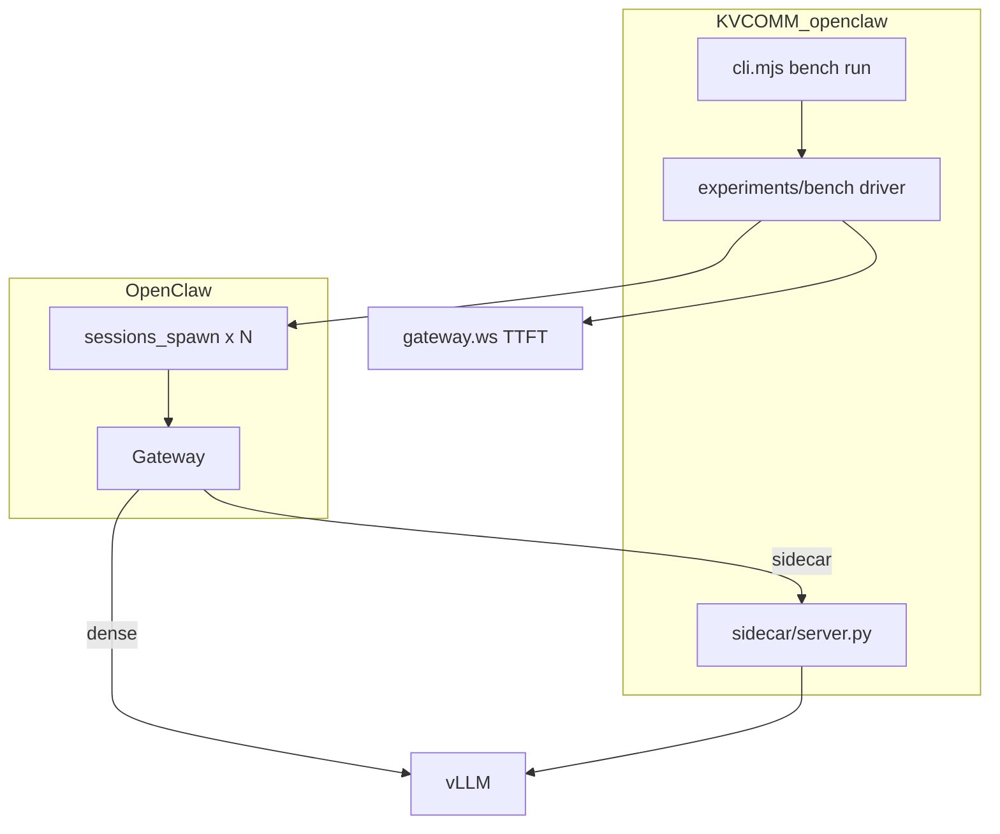

# KVCOMM × OpenClaw 集成模块

本目录是 **KVCOMM 项目中 OpenClaw / ClawBench 集成的唯一主开发位置**。

目标场景：

1. **Sidecar kvreuse 路径**：OpenClaw provider 指向 KVCOMM sidecar，走 kv_reuse 推理链
2. **固定 N-agent benchmark**：harness 驱动 `sessions_spawn`，测量 per-agent TTFT，与模型委派能力解耦

ClawBench 侧 [`tasks-kvcomm/`](../../clawbench/tasks-kvcomm/) 仅为薄封装，实际逻辑在此维护。

## 与 ClawBench 原生配置共存

[`apply-openclaw-profile.py`](scripts/apply-openclaw-profile.py) merge 时**不会**把全局 `tools.profile` 锁为 `minimal`：

- 若已有 ClawBench 的 `tools.profile: coding`（来自 `clawbench/scripts/setup_vllm_clawbench.sh`），KVCOMM setup 会**保留**它
- KVCOMM 仅约束 `agents.list[main]`：`minimal + sessions_spawn`；subagent 工具由各 profile 模板的 `tools.subagents` 控制

推荐：先跑 ClawBench vLLM setup，再跑 KVCOMM setup；两者可反复 merge。

## 目录结构

```
openclaw/
├── cli.mjs                 # 统一入口：bench | sidecar | setup | preflight
├── lib/
│   ├── bench-metadata.mjs  # sidecar-ready jsonl metadata
│   ├── scenario-factory.mjs # 动态 agent_count / Chain 模板
│   └── paths.mjs
├── sidecar/
│   └── server.py           # OpenAI-compat 代理（stub → KVCOMMEngine kvreuse）
├── config/
│   ├── openclaw.kvcomm.dense.json    # OpenClaw → vLLM 直连
│   └── openclaw.kvcomm.sidecar.json  # OpenClaw → sidecar → vLLM
└── scripts/
    ├── setup-openclaw.sh
    └── preflight.sh

experiments/bench/          # bench 实现（spawn-stack、ttft-collector、driver）
```

## 快速开始

### 1. Dense baseline（OpenClaw → vLLM）

```bash
cd KVCOMM/openclaw
npm install   # 可选，CLI 仅依赖 Node 内置模块

# 应用 OpenClaw 配置（含 sessions_spawn 白名单）
./scripts/setup-openclaw.sh dense
# 冷重启 Gateway
openclaw gateway run

# 预检
./scripts/preflight.sh

# 跑 benchmark（3-agent Chain，固定 spawn）
node cli.mjs bench run \
  --agent-count 3 \
  --measure-runs 10 \
  --task-id micro-001 \
  --model vllm/Qwen3-32B \
  --output chain_3_dense_openclaw
```

### 2. Sidecar kvreuse 路径（OpenClaw → KVCOMM sidecar → vLLM）

```bash
# 终端 1：启动 sidecar（当前为透明代理 stub，后续接入 KVCOMMEngine）
export KVCOMM_VLLM_UPSTREAM=http://127.0.0.1:8001/v1
export KVCOMM_MODE=kv_reuse
python3 sidecar/server.py

# 终端 2：应用 sidecar profile 并启动 Gateway
./scripts/setup-openclaw.sh sidecar
openclaw gateway run

# 终端 3：benchmark（warmup 建 anchor，measure 计入 summary）
KVCOMM_INFERENCE_BACKEND=kvcomm_sidecar \
node cli.mjs bench run \
  --inference-mode kv_reuse \
  --inference-backend kvcomm_sidecar \
  --warmup-runs 2 \
  --measure-runs 10 \
  --agent-count 3 \
  --model kvcomm/Qwen3-32B \
  --output chain_3_kvreuse_openclaw

# 长期 bench 前清理膨胀的 main session transcript（建议先停 Gateway）
./scripts/clean-bench-sessions.sh
# 或在 bench 命令中加 --clean-sessions
node cli.mjs bench run --clean-sessions --agent-count 3 --measure-runs 10 ...
```

### 3. 从 ClawBench 调用（薄封装）

```bash
cd clawbench/tasks-kvcomm
npm run run -- --agent-count 3 --measure-runs 5 --dry-run
```

### 4. ClawBench Chain 能力打分（Phase 2）

固定 3-agent Chain + ClawBench 原生任务（workspace + edit/exec），链末 ClawBench scorer。

```bash
# 配置顺序：ClawBench vLLM setup → KVCOMM clawbench-capability → 冷重启 Gateway
bash /src/clawbench/scripts/setup_vllm_clawbench.sh
cd KVCOMM/openclaw && ./scripts/setup-openclaw.sh clawbench-capability
openclaw gateway run

# KVCOMM CLI
node cli.mjs bench run-clawbench \
  --agent-count 3 --measure-runs 3 \
  --task-id t1-fs-quick-note \
  --dataset /src/KVCOMM/experiments/bench/datasets/tier1_clawbench.jsonl \
  --model vllm/Qwen3-32B \
  --output clawbench_chain_quicknote

# 或 ClawBench CLI
cd /src/clawbench
uv run clawbench kvcomm run-clawbench \
  --task-id t1-fs-quick-note --agent-count 3 --measure-runs 3 \
  --model vllm/Qwen3-32B
```

详见 [`../experiments/bench/README.md`](../experiments/bench/README.md)「ClawBench Chain 能力 lane」专节。

## 架构



## 设计约束（sidecar-ready）

| 层 | sidecar 接入后是否变化 |
|----|----------------------|
| `cli.mjs bench run` / scenario / agent_count | **不变** |
| `sessions_spawn` 编排 | **不变** |
| TTFT 采集（gateway.ws） | **不变** |
| OpenClaw provider baseUrl | dense ↔ sidecar profile 切换 |
| jsonl schema | **不变**（`inference_mode` / `inference_backend` 字段区分） |

## Sidecar 演进路线

| 阶段 | sidecar 行为 |
|------|-------------|
| **当前 (stub)** | 透明转发 vLLM，记录 `X-KVCOMM-Mode` |
| **下一步** | 接入 `KVCOMMEngine.generate_with_kv_reuse` |
| **指标 bridge** | `/diagnostics` 暴露 `kvcomm_latency_ms`、`reuse_rate`，bench jsonl 回填 |

## 环境变量

| 变量 | 默认 | 说明 |
|------|------|------|
| `KVCOMM_VLLM_UPSTREAM` | `http://127.0.0.1:8001/v1` | sidecar 上游 vLLM |
| `KVCOMM_SIDECAR_URL` | `http://127.0.0.1:8100` | sidecar 地址 |
| `KVCOMM_MODE` | `dense_prefill` | `dense_prefill` / `kv_reuse` |
| `KVCOMM_HF_MODEL` | — | 本地路径或 Hub id；`Qwen/Qwen3-32B` 自动解析为 `/models/Qwen3-32B` |
| `KVCOMM_HF_DEVICE` | `cuda:0` | **可用 GPU 池**，逗号分隔如 `2,3,4,5`；程序自动选最少张数分片 |
| `KVCOMM_HF_INFERENCE_HEADROOM_GIB` | `12` | 每卡为 KV cache/激活预留的显存（GiB） |
| `KVCOMM_HF_MAX_MEMORY` | _(自动)_ | 手动覆盖每卡 `max_memory`（一般不需要） |
| `KVCOMM_INFERENCE_BACKEND` | `vllm_direct` | bench metadata |
| `COPY_PREFIX_REPEATS` | `64` | 对齐 Python 时设 `512` |
| `COPY_OUT_LENGTH` | `128` | 对齐 Python 时设 `512` |

## 与 Python KVCOMM benchmark 可比性

- **可比**：topology、agent_count、token 预算、同一 task fixture、`dense vs kv_reuse` speedup 趋势
- **不可直接比**：绝对 TTFT（OpenClaw 含框架开销）、Copy 输出格式合格率

详见 bench 输出 jsonl 中的 `comparable_to` / `not_comparable_fields` 字段。
